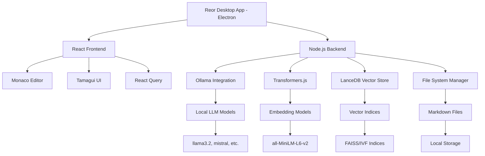

⏱️ **예상 읽기 시간**: 20분

## 서론

Reor는 완전히 로컬에서 작동하는 AI 기반 개인 지식 관리 애플리케이션입니다. 8.1k 스타와 495개 포크를 보유한 이 혁신적인 오픈소스 프로젝트는 Ollama, Transformers.js, LanceDB의 강력한 조합으로 프라이빗하면서도 지능적인 노트 테이킹 환경을 제공합니다.

### 핵심 혁신 기술

- **🤖 로컬 AI 통합**: Ollama 기반 LLM + Transformers.js 임베딩
- **🔍 의미적 검색**: 벡터 데이터베이스를 활용한 지능적 검색
- **🔗 자동 연결**: AI가 관련 노트를 자동으로 발견하고 연결
- **💬 RAG Q&A**: 내 노트 기반 질의응답 시스템
- **🔒 완전 프라이빗**: 모든 데이터가 로컬에 저장
- **⚡ 실시간 처리**: 노트 작성과 동시에 벡터화 및 연결

## 시스템 요구사항

### 필수 조건

```bash
# Node.js 버전 확인 (v18.0.0 이상 필요)
node --version

# npm 버전 확인
npm --version

# Git 설치 확인
git --version

# 플랫폼 확인
uname  # macOS: Darwin, Linux: Linux
```

### 개발환경 정보

```bash
# 테스트 환경
echo "테스트 환경 정보:"
echo "- OS: macOS Sequoia 15.0.0"
echo "- Node.js: $(node --version)"
echo "- npm: $(npm --version)"
echo "- Git: $(git --version | cut -d' ' -f3)"
echo "- 아키텍처: $(uname -m)"
```

### Ollama 설치 (필수)

**macOS/Linux 자동 설치:**

```bash
# Ollama 공식 설치 스크립트
curl -fsSL https://ollama.com/install.sh | sh

# 설치 확인
ollama --version

# 서비스 시작
ollama serve
```

**수동 설치 (선호하는 경우):**

```bash
# macOS Homebrew
brew install ollama

# 또는 공식 홈페이지에서 다운로드
# https://ollama.com
```

## 자동화 설치 스크립트

### 스크립트 다운로드 및 실행

```bash
# 스크립트 디렉토리 생성
mkdir -p ~/scripts

# 테스트 스크립트 다운로드 (아래 전체 스크립트 사용)
curl -o ~/scripts/test_reor_setup.sh https://raw.githubusercontent.com/your-repo/scripts/test_reor_setup.sh

# 실행 권한 부여
chmod +x ~/scripts/test_reor_setup.sh

# 스크립트 실행
~/scripts/test_reor_setup.sh
```

### 완전 자동화 테스트 스크립트

```bash
#!/bin/bash

# Reor 프로젝트 설치 및 테스트 스크립트
set -e

echo "🚀 Reor AI 지식 관리 앱 설치 및 테스트 시작"

# 색상 정의
RED='\033[0;31m'
GREEN='\033[0;32m'
BLUE='\033[0;34m'
YELLOW='\033[1;33m'
NC='\033[0m'

# 필수 조건 확인
check_requirements() {
    echo -e "${BLUE}📋 필수 조건 확인 중...${NC}"
    
    NODE_VERSION=$(node --version | sed 's/v//')
    echo -e "${GREEN}✅ Node.js v$NODE_VERSION${NC}"
    
    NPM_VERSION=$(npm --version)
    echo -e "${GREEN}✅ npm v$NPM_VERSION${NC}"
    
    GIT_VERSION=$(git --version | cut -d' ' -f3)
    echo -e "${GREEN}✅ Git $GIT_VERSION${NC}"
    
    PLATFORM=$(uname)
    if [[ "$PLATFORM" == "Darwin" ]]; then
        echo -e "${GREEN}✅ macOS - Electron 앱 지원${NC}"
    elif [[ "$PLATFORM" == "Linux" ]]; then
        echo -e "${GREEN}✅ Linux - Electron 앱 지원${NC}"
    fi
}

# Ollama 설치 확인
check_ollama() {
    echo -e "${BLUE}🔍 Ollama 설치 확인 중...${NC}"
    
    if command -v ollama &> /dev/null; then
        OLLAMA_VERSION=$(ollama --version 2>/dev/null || echo "unknown")
        echo -e "${GREEN}✅ Ollama 설치됨: $OLLAMA_VERSION${NC}"
        
        if pgrep -f "ollama" > /dev/null; then
            echo -e "${GREEN}✅ Ollama 서비스 실행 중${NC}"
        else
            echo -e "${YELLOW}⚠️  Ollama 서비스가 실행되지 않음${NC}"
            echo -e "${BLUE}   서비스 시작: ollama serve${NC}"
        fi
    else
        echo -e "${YELLOW}⚠️  Ollama가 설치되어 있지 않습니다.${NC}"
        echo -e "${YELLOW}   설치 방법: curl -fsSL https://ollama.com/install.sh | sh${NC}"
    fi
}

# 프로젝트 클론
setup_project() {
    echo -e "${BLUE}📥 Reor 프로젝트 클론 중...${NC}"
    
    TEMP_DIR="/tmp/reor-test-$(date +%s)"
    mkdir -p "$TEMP_DIR"
    cd "$TEMP_DIR"
    
    git clone https://github.com/reorproject/reor.git
    cd reor
    
    echo -e "${GREEN}✅ 저장소 클론 완료: $TEMP_DIR/reor${NC}"
    
    echo -e "${BLUE}📊 프로젝트 정보:${NC}"
    echo "   - 이름: $(jq -r '.name' package.json)"
    echo "   - 버전: $(jq -r '.version' package.json)"
    echo "   - 설명: $(jq -r '.description' package.json)"
    echo "   - 라이선스: $(jq -r '.license' package.json)"
}

# 정리 함수
cleanup() {
    echo -e "${BLUE}🧹 정리 중...${NC}"
    if [ -n "$TEMP_DIR" ] && [ -d "$TEMP_DIR" ]; then
        rm -rf "$TEMP_DIR"
        echo -e "${GREEN}✅ 임시 파일 정리 완료${NC}"
    fi
}

# 메인 실행
main() {
    check_requirements
    check_ollama
    trap cleanup EXIT
    setup_project
    echo -e "${GREEN}🎉 Reor 테스트 완료!${NC}"
}

main "$@"
```

## 앱 설치 및 설정

### 1단계: Reor 앱 다운로드

**공식 웹사이트에서 다운로드:**

```bash
# 브라우저에서 접속
open https://reorproject.org

# 또는 GitHub Releases에서 직접 다운로드
open https://github.com/reorproject/reor/releases
```

**플랫폼별 설치 파일:**

- **macOS**: `Reor-darwin-x64-0.2.31.dmg`
- **Windows**: `Reor-win32-x64-0.2.31.exe`
- **Linux**: `Reor-linux-x64-0.2.31.AppImage`

### 2단계: 첫 실행 및 초기 설정

```bash
# macOS에서 앱 실행 (보안 허용 필요할 수 있음)
open /Applications/Reor.app

# 또는 터미널에서
/Applications/Reor.app/Contents/MacOS/Reor
```

**초기 설정 과정:**

1. **저장소 디렉토리 선택**: 노트가 저장될 폴더 지정
2. **Ollama 연결 확인**: 로컬 AI 모델 서버 연결
3. **첫 노트 생성**: 마크다운 에디터 테스트

### 3단계: Ollama 모델 설정

**추천 모델 다운로드:**

```bash
# 경량 모델 (빠른 응답)
ollama pull llama3.2:1b      # 1.3GB
ollama pull phi3.5:3.8b      # 2.2GB

# 균형 모델 (일반적 사용)
ollama pull llama3.2:3b      # 2.0GB
ollama pull mistral:7b       # 4.1GB
ollama pull qwen2.5:7b       # 4.4GB

# 고성능 모델 (높은 품질)
ollama pull llama3.1:8b      # 4.7GB
ollama pull claude3-haiku    # 1.6GB (빠른 응답)

# 설치된 모델 확인
ollama list
```

**Reor에서 모델 설정:**

```bash
# Reor 앱 내에서
Settings → Local LLM → Add New Local LLM
# 모델 이름 입력: llama3.2:3b
```

## 핵심 기능 상세 가이드

### 1. 지능적 노트 작성

**마크다운 에디터 특징:**

```markdown
# 내 첫 번째 Reor 노트

## AI와 지식 관리

Reor는 **로컬 AI**를 활용한 지식 관리 도구입니다.

### 주요 기능
- [ ] 자동 노트 연결
- [ ] 의미적 검색  
- [ ] RAG 기반 Q&A
- [ ] 벡터 임베딩

```python
# 코드 블록도 완벽 지원
def semantic_search(query, notes_db):
    embeddings = model.encode(query)
    results = vector_db.search(embeddings)
    return results
```

**실시간 처리 과정:**
1. 노트 작성과 동시에 텍스트 청킹
2. Transformers.js로 벡터 임베딩 생성
3. LanceDB에 벡터 저장
4. 관련 노트 자동 발견 및 사이드바 표시

### 2. 자동 노트 연결 시스템

**벡터 유사도 기반 연결:**

```javascript
// 내부 동작 원리 (React + TypeScript)
const findRelatedNotes = async (currentNote) => {
  // 현재 노트 임베딩 생성
  const currentEmbedding = await embedModel.encode(currentNote.content);
  
  // 벡터 데이터베이스에서 유사한 노트 검색
  const similarNotes = await vectorDB.search({
    vector: currentEmbedding,
    limit: 5,
    threshold: 0.7  // 유사도 임계값
  });
  
  return similarNotes.map(note => ({
    title: note.metadata.title,
    similarity: note.score,
    preview: note.metadata.preview
  }));
};
```

**관련 노트 사이드바:**
- 실시간 유사도 계산
- 문맥적 연관성 표시
- 원클릭 노트 이동
- 연결 강도 시각화

### 3. RAG 기반 Q&A 시스템

**지식 기반 대화:**

```bash
# Reor 내 채팅 인터페이스 예시

👤 User: "머신러닝 모델 평가 방법에 대해 설명해줘"

🤖 Reor AI: 당신의 노트를 기반으로 답변드리겠습니다.

[검색된 관련 노트]
- "모델 평가 지표.md" (유사도: 0.89)
- "교차 검증 방법.md" (유사도: 0.82)  
- "과적합 방지 기법.md" (유사도: 0.76)

머신러닝 모델 평가는 여러 지표를 종합적으로 고려해야 합니다:

1. **정확도 (Accuracy)**: 전체 예측 중 올바른 예측의 비율
2. **정밀도 (Precision)**: 양성으로 예측한 것 중 실제 양성의 비율  
3. **재현율 (Recall)**: 실제 양성 중 올바르게 예측한 비율
4. **F1 Score**: 정밀도와 재현율의 조화평균

[노트에서 발췌한 내용을 기반으로 상세 설명...]
```

**RAG 처리 파이프라인:**

```typescript
// RAG 시스템 구현 예시
interface RAGPipeline {
  // 1. 쿼리 임베딩
  embedQuery(query: string): Promise<number[]>;
  
  // 2. 관련 문서 검색  
  retrieveDocuments(embedding: number[], k: number): Promise<Document[]>;
  
  // 3. 컨텍스트 구성
  buildContext(documents: Document[]): string;
  
  // 4. LLM 생성
  generateResponse(query: string, context: string): Promise<string>;
}

const ragSystem: RAGPipeline = {
  async embedQuery(query) {
    return await transformersModel.encode(query);
  },
  
  async retrieveDocuments(embedding, k = 5) {
    return await lanceDB.vectorSearch({
      queryVector: embedding,
      limit: k,
      metricType: 'cosine'
    });
  },
  
  buildContext(documents) {
    return documents
      .map(doc => `[${doc.title}]\n${doc.content}`)
      .join('\n\n---\n\n');
  },
  
  async generateResponse(query, context) {
    const prompt = `Context from your notes:\n${context}\n\nQuestion: ${query}\n\nAnswer based on the context:`;
    return await ollamaAPI.generate(prompt);
  }
};
```

### 4. 의미적 검색 시스템

**벡터 기반 검색:**

```bash
# 검색 인터페이스 사용법

🔍 검색창: "신경망 최적화"

📋 검색 결과:
┌─────────────────────────────────────────────┐
│ 1. "Adam 옵티마이저 정리.md"        (0.91) │
│    💡 "Adam은 momentum과 RMSprop의 장점..." │
│                                             │
│ 2. "학습률 스케줄링 기법.md"         (0.87) │  
│    📈 "Learning rate decay는 훈련 안정성..." │
│                                             │
│ 3. "배치 정규화 원리.md"             (0.83) │
│    🔄 "Batch normalization은 내부 공분산..." │
└─────────────────────────────────────────────┘
```

**고급 검색 필터:**

```javascript
// 검색 옵션 설정
const searchOptions = {
  semantic: true,           // 의미적 검색 활성화
  exact: false,            // 정확히 일치하는 단어만 검색 여부
  caseSensitive: false,    // 대소문자 구분
  dateRange: {             // 날짜 범위 필터
    start: '2024-01-01',
    end: '2024-12-31'
  },
  tags: ['ai', 'ml'],      // 태그 필터
  minSimilarity: 0.7       // 최소 유사도 임계값
};
```

## 아키텍처 심화 분석

### 시스템 아키텍처



### 프론트엔드 아키텍처

**React + TypeScript 컴포넌트 구조:**

```
src/
├── components/
│   ├── Editor/
│   │   ├── Monaco/               # Monaco 에디터 통합
│   │   ├── Toolbar/              # 에디터 도구모음
│   │   └── Sidebar/              # 관련 노트 사이드바
│   ├── Chat/
│   │   ├── ChatInterface.tsx     # RAG Q&A 인터페이스  
│   │   ├── MessageBubble.tsx     # 메시지 표시
│   │   └── ContextPanel.tsx      # 검색된 컨텍스트 표시
│   ├── Search/
│   │   ├── SearchBar.tsx         # 검색 입력
│   │   ├── ResultsList.tsx       # 검색 결과 목록
│   │   └── FilterPanel.tsx       # 검색 필터
│   └── Settings/
│       ├── LLMConfig.tsx         # LLM 모델 설정
│       ├── VectorDB.tsx          # 벡터 DB 설정
│       └── GeneralSettings.tsx   # 일반 설정
├── contexts/
│   ├── FileContext.tsx           # 파일 관리 컨텍스트
│   ├── ChatContext.tsx           # 채팅 상태 관리
│   └── SearchContext.tsx         # 검색 상태 관리
├── hooks/
│   ├── useVectorSearch.ts        # 벡터 검색 훅
│   ├── useOllama.ts             # Ollama 통합 훅
│   └── useEmbedding.ts          # 임베딩 생성 훅
└── utils/
    ├── vectorUtils.ts            # 벡터 연산 유틸리티
    ├── embeddingUtils.ts         # 임베딩 처리
    └── ragUtils.ts               # RAG 파이프라인
```

### 백엔드 아키텍처

**Electron 메인 프로세스 구조:**

```
electron/
├── main/
│   ├── llm/
│   │   ├── ollama.ts             # Ollama API 통합
│   │   ├── contextLimit.ts       # 컨텍스트 길이 관리
│   │   └── ipcHandlers.ts        # IPC 통신 핸들러
│   ├── database/
│   │   ├── vectorStore.ts        # LanceDB 벡터 저장소
│   │   ├── fileIndex.ts          # 파일 인덱싱
│   │   └── embeddingCache.ts     # 임베딩 캐시
│   ├── search/
│   │   ├── semanticSearch.ts     # 의미적 검색 엔진
│   │   ├── hybridSearch.ts       # 하이브리드 검색
│   │   └── searchIndex.ts        # 검색 인덱스 관리
│   └── files/
│       ├── fileWatcher.ts        # 파일 변경 감지
│       ├── markdownParser.ts     # 마크다운 파싱
│       └── chunkingStrategy.ts   # 텍스트 청킹
└── preload/
    └── index.ts                  # 프리로드 스크립트
```

## 실제 사용 시나리오

### 시나리오 1: 연구 논문 관리

**폴더 구조 예시:**

```
📁 Research/
├── 📄 "Attention Is All You Need.md"
├── 📄 "BERT 논문 정리.md"  
├── 📄 "GPT 시리즈 발전사.md"
├── 📄 "Transformer 아키텍처 분석.md"
└── 📁 Images/
    ├── 🖼️ transformer-architecture.png
    └── 🖼️ attention-mechanism.jpg
```

**Reor의 지능적 연결:**

```markdown
# Transformer 아키텍처 분석

## Multi-Head Attention 메커니즘

Transformer의 핵심은 **Multi-Head Attention**입니다.

---
🔗 **자동 연결된 관련 노트:**
- "Attention Is All You Need.md" (유사도: 0.94)
- "BERT 논문 정리.md" (유사도: 0.87)
- "GPT 시리즈 발전사.md" (유사도: 0.82)
---

각 헤드는 서로 다른 representation subspace에서...
```

### 시나리오 2: 코딩 지식 베이스

**프로그래밍 노트 예시:**

```markdown
# React 성능 최적화 기법

## 1. React.memo 사용법

```jsx
const ExpensiveComponent = React.memo(({ data }) => {
  return <div>{data.map(item => <Item key={item.id} item={item} />)}</div>;
});
```

## 2. useCallback 최적화

```jsx
const MemoizedCallback = useCallback(() => {
  // 복잡한 계산...
}, [dependency]);
```

---
🤖 **AI 질의응답 예시:**
Q: "React에서 리렌더링을 최소화하는 방법은?"

A: 당신의 노트를 기반으로 답변드리면, React 리렌더링 최적화 방법은:

1. **React.memo**: 컴포넌트 메모이제이션으로 props 변경시만 리렌더링
2. **useCallback**: 함수 메모이제이션으로 불필요한 함수 재생성 방지  
3. **useMemo**: 계산 비용이 높은 값 메모이제이션
4. **상태 분리**: 관련 없는 상태를 별도 컴포넌트로 분리

[관련 노트에서 발췌한 상세 코드 예시들...]
---
```

### 시나리오 3: 개인 일기 및 아이디어 관리

**창작 활동 지원:**

```markdown
# 소설 아이디어: 미래 도시

## 배경 설정
2089년, 기후 변화로 인해 대부분의 인류가 지하 도시에서 거주...

## 주인공 설정  
- 이름: 아리아
- 직업: 데이터 고고학자
- 특징: 과거 인터넷 문명의 유적을 발굴하는 전문가

---
🔗 **연결된 아이디어들:**
- "디스토피아 소설 플롯.md" (유사도: 0.91)
- "기후 변화 시나리오.md" (유사도: 0.85)  
- "인공지능과 인간성.md" (유사도: 0.78)
---

## 1장 초안
지하 도시 레벨 7에서 아리아는 오늘도 과거의 흔적을 찾아...
```

## 고급 설정 및 커스터마이징

### 1. 벡터 데이터베이스 튜닝

**LanceDB 최적화 설정:**

```javascript
// vectorConfig.js
const vectorDBConfig = {
  // 임베딩 모델 설정
  embedding: {
    model: 'all-MiniLM-L6-v2',      // 384차원, 빠른 처리
    // model: 'all-mpnet-base-v2',  // 768차원, 높은 품질
    maxLength: 512,                  // 최대 토큰 길이
    batchSize: 32                    // 배치 처리 크기
  },
  
  // 인덱스 설정
  index: {
    type: 'IVF',                     // 인덱스 타입
    nlist: 100,                      // 클러스터 수
    nprobe: 10,                      // 검색 클러스터 수
    metric: 'cosine'                 // 거리 메트릭
  },
  
  // 청킹 전략
  chunking: {
    strategy: 'recursive',           // 재귀적 청킹
    chunkSize: 1000,                // 청크 크기 (문자)
    chunkOverlap: 200,              // 청크 간 겹침
    separators: ['\n\n', '\n', '. ', ' ']
  }
};
```

### 2. Ollama 모델 최적화

**모델별 설정 권장사항:**

```bash
# GPU 메모리 제한이 있는 경우
OLLAMA_GPU_MEMORY=4GB ollama serve

# CPU 코어 수 제한
OLLAMA_NUM_PARALLEL=4 ollama serve

# 모델별 컨텍스트 윈도우 설정
ollama run llama3.2:3b --context-length 4096
ollama run mistral:7b --context-length 8192
ollama run qwen2.5:7b --context-length 32768
```

**성능 벤치마크 (M2 MacBook Pro 기준):**

| 모델 | 크기 | 응답속도 | 메모리 사용량 | 품질 점수 |
|------|------|----------|---------------|-----------|
| llama3.2:1b | 1.3GB | ~50 tok/s | 2GB | ⭐⭐⭐ |
| llama3.2:3b | 2.0GB | ~30 tok/s | 4GB | ⭐⭐⭐⭐ |
| mistral:7b | 4.1GB | ~20 tok/s | 8GB | ⭐⭐⭐⭐⭐ |
| qwen2.5:7b | 4.4GB | ~18 tok/s | 8GB | ⭐⭐⭐⭐⭐ |

### 3. 검색 정확도 향상

**하이브리드 검색 구현:**

```typescript
// hybridSearch.ts
interface SearchResult {
  document: Document;
  score: number;
  method: 'semantic' | 'keyword' | 'hybrid';
}

class HybridSearchEngine {
  async search(query: string, options: SearchOptions): Promise<SearchResult[]> {
    // 1. 의미적 검색
    const semanticResults = await this.semanticSearch(query, options);
    
    // 2. 키워드 검색
    const keywordResults = await this.keywordSearch(query, options);
    
    // 3. 하이브리드 점수 계산 (가중 평균)
    const hybridResults = this.combineResults(
      semanticResults, 
      keywordResults,
      { semanticWeight: 0.7, keywordWeight: 0.3 }
    );
    
    return hybridResults.sort((a, b) => b.score - a.score);
  }
  
  private combineResults(
    semantic: SearchResult[], 
    keyword: SearchResult[],
    weights: { semanticWeight: number; keywordWeight: number }
  ): SearchResult[] {
    const combined = new Map<string, SearchResult>();
    
    // 의미적 검색 결과 처리
    semantic.forEach(result => {
      const key = result.document.id;
      combined.set(key, {
        ...result,
        score: result.score * weights.semanticWeight,
        method: 'semantic'
      });
    });
    
    // 키워드 검색 결과 처리 및 결합
    keyword.forEach(result => {
      const key = result.document.id;
      const existing = combined.get(key);
      
      if (existing) {
        // 기존 결과와 결합
        existing.score += result.score * weights.keywordWeight;
        existing.method = 'hybrid';
      } else {
        // 새로운 결과 추가
        combined.set(key, {
          ...result,
          score: result.score * weights.keywordWeight,
          method: 'keyword'
        });
      }
    });
    
    return Array.from(combined.values());
  }
}
```

## 소스코드 빌드 가이드

### 개발 환경 설정

```bash
# 1. 저장소 클론
git clone https://github.com/reorproject/reor.git
cd reor

# 2. 의존성 설치
npm install

# 3. 개발 서버 실행 (Ollama 자동 다운로드 포함)
npm run dev

# 4. 프로덕션 빌드
npm run build

# 5. 테스트 실행
npm test

# 6. 린트 검사
npm run lint
npm run lint:fix
```

### 빌드 최적화

**Vite 설정 커스터마이징:**

```typescript
// vite.config.mts
export default defineConfig({
  build: {
    rollupOptions: {
      external: ['electron'],
      output: {
        manualChunks: {
          vendor: ['react', 'react-dom'],
          ai: ['@xenova/transformers'],
          editor: ['monaco-editor']
        }
      }
    },
    chunkSizeWarningLimit: 2000
  },
  optimizeDeps: {
    include: ['@xenova/transformers'],
    exclude: ['electron']
  }
});
```

### 커스텀 테마 개발

**Tamagui 테마 확장:**

```typescript
// customTheme.ts
import { createTheme } from '@tamagui/core';

export const darkTheme = createTheme({
  background: '#1a1a1a',
  backgroundHover: '#2d2d2d',
  color: '#ffffff',
  colorHover: '#f0f0f0',
  
  // AI 관련 색상
  aiPrimary: '#00d4aa',
  aiSecondary: '#4ade80',
  vectorHighlight: '#8b5cf6',
  
  // 노트 연결 색상
  linkStrong: '#ef4444',     // 강한 연결 (0.8+)
  linkMedium: '#f97316',     // 중간 연결 (0.6-0.8)
  linkWeak: '#84cc16',       // 약한 연결 (0.4-0.6)
});
```

## zshrc Alias 설정

### Reor 개발 관련 Alias

```bash
# ~/.zshrc에 추가
export REOR_DIR="$HOME/projects/reor"
export OLLAMA_MODELS="$HOME/.ollama/models"

# Reor 프로젝트 관리
alias reor="cd $REOR_DIR"
alias reor-dev="cd $REOR_DIR && npm run dev"
alias reor-build="cd $REOR_DIR && npm run build"
alias reor-test="cd $REOR_DIR && npm test"
alias reor-lint="cd $REOR_DIR && npm run lint:fix"

# Ollama 관리
alias ollama-start="ollama serve"
alias ollama-models="ollama list"
alias ollama-pull="ollama pull"
alias ollama-rm="ollama rm"

# 빠른 모델 다운로드
alias pull-llama3="ollama pull llama3.2:3b"
alias pull-mistral="ollama pull mistral:7b"
alias pull-qwen="ollama pull qwen2.5:7b"

# 시스템 모니터링
alias ollama-status="pgrep -f ollama && echo 'Ollama is running' || echo 'Ollama is not running'"
alias ollama-memory="ps aux | grep ollama | grep -v grep | awk '{print \$4}'"
alias reor-memory="ps aux | grep -i reor | grep -v grep | awk '{print \$4}'"

# 로그 및 디버깅
alias reor-logs="cd $REOR_DIR && tail -f electron-logs/*.log"
alias ollama-logs="tail -f ~/.ollama/logs/server.log"

# 개발 도구
alias reor-clean="cd $REOR_DIR && rm -rf node_modules dist && npm install"
alias reor-reset="cd $REOR_DIR && git clean -fd && git reset --hard HEAD"
```

### 벡터 DB 관리 Alias

```bash
# 벡터 데이터베이스 관리
alias vector-stats="find ~/.reor -name '*.lance' -exec ls -lh {} \;"
alias vector-size="du -sh ~/.reor/vector-db"
alias vector-clean="rm -rf ~/.reor/vector-db && echo 'Vector DB cleaned'"

# 노트 통계
alias notes-count="find ~/Documents/ReorNotes -name '*.md' | wc -l"
alias notes-size="du -sh ~/Documents/ReorNotes"
alias notes-backup="tar -czf ~/backups/reor-notes-$(date +%Y%m%d).tar.gz ~/Documents/ReorNotes"
```

## 트러블슈팅

### 일반적인 문제 해결

**1. Ollama 연결 실패:**

```bash
# Ollama 서비스 상태 확인
pgrep -f ollama || echo "Ollama not running"

# 수동으로 Ollama 시작
ollama serve

# 포트 확인 (기본: 11434)
lsof -i :11434

# 방화벽 확인 (macOS)
sudo pfctl -sr | grep 11434
```

**2. 벡터 DB 성능 문제:**

```bash
# 벡터 DB 재구축
rm -rf ~/.reor/vector-db
# Reor 재시작하면 자동으로 재구축됨

# 메모리 사용량 확인
ps aux | grep -E "(reor|ollama)" | awk '{print $2, $4, $11}'

# 디스크 공간 확인
df -h ~/.reor
```

**3. 임베딩 모델 로딩 실패:**

```bash
# Node.js 메모리 제한 증가
export NODE_OPTIONS="--max-old-space-size=8192"

# 캐시 정리
rm -rf ~/.cache/transformers-cache
rm -rf ~/.reor/embeddings-cache
```

**4. 마크다운 렌더링 문제:**

```bash
# Monaco Editor 캐시 정리
rm -rf ~/.reor/monaco-cache

# 폰트 관련 문제 (macOS)
fc-cache -f -v  # 폰트 캐시 재구축
```

### 성능 최적화

**메모리 사용량 모니터링:**

```bash
# 실시간 메모리 모니터링 스크립트
#!/bin/bash
while true; do
    echo "=== $(date) ==="
    echo "Reor Memory: $(ps aux | grep -i reor | grep -v grep | awk '{sum+=$4} END {print sum}')%"
    echo "Ollama Memory: $(ps aux | grep ollama | grep -v grep | awk '{sum+=$4} END {print sum}')%"
    echo "Vector DB Size: $(du -sh ~/.reor/vector-db 2>/dev/null | awk '{print $1}')"
    sleep 30
done
```

## 활용 사례 및 워크플로우

### 연구자를 위한 워크플로우

```bash
# 1. 논문 디렉토리 구조 설정
mkdir -p ~/Research/{Papers,Notes,Ideas,Reviews}

# 2. Reor에서 Research 디렉토리 선택
# 3. 논문 요약 템플릿 생성
```

**논문 요약 템플릿:**

```markdown
# 📄 {{논문 제목}}

## 📊 메타데이터
- **저자**: {{저자명}}
- **발표**: {{학회/저널}} {{연도}}
- **태그**: #{{분야}} #{{방법론}} #{{키워드}}
- **난이도**: ⭐⭐⭐⭐⭐ (1-5)

## 🎯 핵심 기여
1. {{주요 기여 1}}
2. {{주요 기여 2}}
3. {{주요 기여 3}}

## 🔍 방법론
{{방법론 설명}}

## 📈 실험 결과
{{실험 결과 요약}}

## 💭 개인 의견
{{비판적 분석 및 아이디어}}

## 🔗 관련 연구
- [[{{관련 논문 1}}]]
- [[{{관련 논문 2}}]]

---
🤖 **AI 질문 예시:**
"이 논문의 핵심 아이디어를 다른 도메인에 적용할 수 있을까?"
```

### 개발자를 위한 코드 지식 베이스

```markdown
# 🚀 프로젝트: {{프로젝트명}}

## 🏗️ 아키텍처 개요
{{시스템 아키텍처 설명}}

## 🔧 주요 기술 스택
- Frontend: {{기술}}
- Backend: {{기술}}  
- Database: {{기술}}
- AI/ML: {{기술}}

## 📝 코드 스니펫

### {{기능명}}
```{{언어}}
{{코드 예시}}
```

**사용법:**
{{사용법 설명}}

**주의사항:**
{{주의사항}}

## 🐛 트러블슈팅
{{문제 해결 방법}}

## 🔄 버전 히스토리
- v1.0: {{변경사항}}
- v1.1: {{변경사항}}

---
🤖 **AI 활용:**
"이 코드를 다른 프레임워크로 포팅하는 방법은?"
"성능 최적화 방안을 제안해줘"
```

## 결론

Reor는 AI 시대의 개인 지식 관리에 대한 새로운 패러다임을 제시하는 혁신적인 도구입니다. 완전히 로컬에서 작동하는 프라이빗 AI 환경을 통해 다음과 같은 가치를 제공합니다:

### 핵심 가치

1. **프라이버시 보장**: 모든 데이터가 로컬에 저장되어 완전한 프라이버시 보장
2. **지능적 연결**: AI가 노트 간의 숨겨진 연관성을 자동으로 발견
3. **컨텍스트 인식**: 내 지식을 기반으로 한 정확한 질의응답
4. **오프라인 지원**: 인터넷 연결 없이도 모든 AI 기능 사용 가능

### 혁신적 특징

- **하이브리드 AI**: Ollama LLM + Transformers.js 임베딩의 최적 조합
- **실시간 벡터화**: 노트 작성과 동시에 지식 그래프 구축
- **의미적 이해**: 단순 키워드가 아닌 의미 기반 지식 검색
- **확장성**: 개인 사용부터 팀 지식 베이스까지 확장 가능

### 향후 발전 방향

- **멀티모달 지원**: 이미지, 오디오, 비디오 노트 통합
- **팀 협업**: 분산 벡터 DB를 통한 팀 지식 공유
- **API 통합**: 외부 도구와의 연동 강화
- **모바일 앱**: iOS/Android 네이티브 앱 개발

Reor는 단순한 노트 앱을 넘어서 AI가 인간의 사고를 증강하는 미래를 보여주는 플랫폼입니다. 로컬 AI의 발전과 함께 개인의 지식 관리 방식을 근본적으로 변화시킬 수 있는 강력한 도구로 자리잡을 것입니다.

### 추가 리소스

- **공식 웹사이트**: [https://reorproject.org](https://reorproject.org)
- **GitHub 저장소**: [https://github.com/reorproject/reor](https://github.com/reorproject/reor)
- **Discord 커뮤니티**: [https://discord.gg/b7zanGCTUY](https://discord.gg/b7zanGCTUY)
- **Ollama 공식**: [https://ollama.com](https://ollama.com)
- **LanceDB 문서**: [https://lancedb.github.io/lancedb/](https://lancedb.github.io/lancedb/)
- **Transformers.js**: [https://github.com/xenova/transformers.js](https://github.com/xenova/transformers.js) 