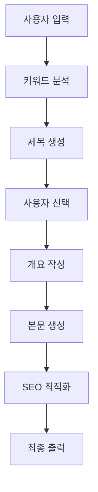

⏱️ **예상 읽기 시간**: 12분

## 서론

Google Labs에서 2025년 7월 24일 공개한 **Opal**은 AI 개발 패러다임을 바꿀 혁신적인 도구입니다. 코딩 없이 자연어만으로 강력한 AI 미니 앱을 구축할 수 있는 이 실험적 플랫폼은 프롬프트, AI 모델, 도구들을 체이닝하여 복잡한 워크플로우를 시각적으로 설계할 수 있게 해줍니다.

이 튜토리얼에서는 Opal의 핵심 기능부터 실제 AI 미니 앱 제작까지 단계별로 상세히 다뤄보겠습니다.

## Opal이란 무엇인가?

### 핵심 개념

**Opal**은 Google Labs의 실험적 AI 앱 빌더로, 다음과 같은 혁신적 기능을 제공합니다:

- **자연어 기반 워크플로우 생성**: 복잡한 AI 로직을 자연어로 설명하면 자동으로 시각적 워크플로우로 변환
- **프롬프트 체이닝**: 여러 AI 모델 호출과 도구를 연결하여 복합적인 작업 수행
- **비주얼 에디터**: 코드 없이 드래그 앤 드롭으로 워크플로우 편집
- **즉시 공유**: 완성된 앱을 바로 다른 사용자와 공유 가능

### 현재 상태 및 접근성

```bash
# 현재 상태 (2025년 7월 기준)
- 상태: US 전용 공개 베타
- 접근: Google 계정 필요
- 가격: 베타 기간 중 무료
- 지원 언어: 영어 우선
```

## 시작하기 전 준비사항

### 필수 요구사항

1. **Google 계정**: Opal 액세스 및 앱 공유용
2. **미국 VPN**: 현재 US 전용 서비스
3. **웹 브라우저**: Chrome, Firefox, Safari 최신 버전
4. **인터넷 연결**: 클라우드 기반 서비스

### 권장 준비사항

```markdown
# AI 프롬프트 작성 기본 지식
- 명확한 지시문 작성법
- 컨텍스트 제공 방법
- 출력 형식 지정법

# 워크플로우 설계 기본 개념
- 단계별 작업 분해
- 입력/출력 정의
- 조건부 로직 이해
```

## Opal 시작하기

### 1단계: Opal 접속 및 첫 인상

```bash
# Opal 접속 URL
https://labs.google.com/opal
```

**첫 화면 구성 요소:**

1. **데모 갤러리**: 미리 제작된 템플릿 앱들
2. **새 앱 만들기**: 빈 워크플로우에서 시작
3. **최근 작업**: 이전에 작성한 앱들
4. **공유된 앱**: 다른 사용자가 공유한 앱들

### 2단계: 데모 갤러리 탐색

**추천 시작 템플릿:**

| 템플릿 명 | 용도 | 난이도 |
|---|---|---|
| **이메일 작성기** | 업무용 이메일 자동 생성 | 초급 |
| **콘텐츠 요약기** | 긴 문서를 간결하게 요약 | 초급 |
| **데이터 분석기** | CSV 데이터 분석 및 시각화 | 중급 |
| **언어 번역기** | 다국어 번역 및 문화적 맥락 추가 | 중급 |
| **코드 리뷰어** | 코드 품질 검토 및 개선 제안 | 고급 |

### 3단계: 첫 번째 앱 만들기

**"스마트 블로그 포스트 생성기" 실습**

```markdown
# 목표: 키워드를 입력하면 SEO 최적화된 블로그 포스트를 생성하는 앱

1. 키워드 입력 받기
2. 키워드 기반 제목 생성
3. 개요 작성
4. 본문 작성
5. SEO 메타데이터 생성
6. 최종 포맷팅
```

## 워크플로우 설계 및 구축

### 자연어로 워크플로우 설명하기

**효과적인 설명 방법:**

```text
사용자가 키워드를 입력하면:
1. 먼저 그 키워드와 관련된 트렌딩 토픽을 검색해줘
2. 검색 결과를 바탕으로 매력적인 블로그 제목 5개를 생성해줘
3. 사용자가 제목을 선택하면 해당 제목에 맞는 상세한 개요를 작성해줘
4. 개요를 바탕으로 2000단어 분량의 본문을 작성해줘
5. 마지막으로 SEO에 최적화된 메타 제목과 설명을 생성해줘
```

### 비주얼 에디터 활용법

**워크플로우 노드 유형:**

1. **입력 노드**: 사용자로부터 데이터 받기
2. **AI 모델 노드**: 특정 AI 모델 호출
3. **도구 노드**: 외부 API나 서비스 연결
4. **조건 노드**: if/else 로직 구현
5. **출력 노드**: 결과를 사용자에게 표시

**노드 연결 규칙:**



### 프롬프트 최적화 기법

**효과적인 프롬프트 작성법:**

```text
# 좋은 프롬프트 예시
"""
역할: 당신은 10년 경력의 SEO 전문 블로그 작가입니다.

작업: 주어진 키워드 "{keyword}"에 대해 검색 엔진에서 상위 랭킹을 목표로 하는 블로그 제목을 5개 생성해주세요.

요구사항:
1. 제목은 60자 이내로 작성
2. 감정적 임팩트가 있는 단어 포함
3. 숫자나 구체적 표현 활용
4. 타겟 키워드 자연스럽게 포함

출력 형식:
1. [제목 1]
2. [제목 2]
...
"""
```

**피해야 할 프롬프트 실수:**

```text
# 나쁜 프롬프트 예시
"블로그 제목 만들어줘"  # 너무 모호함
"제목을 {keyword}로 만들어줘"  # 구체적 요구사항 부족
```

## 고급 기능 활용법

### API 연동 및 외부 도구 활용

**지원되는 외부 서비스:**

1. **웹 검색 API**: 실시간 정보 검색
2. **이미지 생성 API**: DALL-E, Midjourney 연동
3. **데이터베이스 연결**: 구글 시트, Airtable
4. **소셜 미디어**: Twitter, LinkedIn API
5. **파일 처리**: PDF, 문서 파일 분석

**API 연동 설정 방법:**

```yaml
# API 설정 예시 (YAML 형태로 설정)

external_tools:
  web_search:
    provider: "google_search"
    api_key: "{{ env.GOOGLE_SEARCH_API_KEY }}"
    max_results: 10
  
  image_generation:
    provider: "dall_e_3"
    api_key: "{{ env.OPENAI_API_KEY }}"
    size: "1024x1024"
    quality: "hd"

```

### 조건부 로직 구현

**if/else 구조 만들기:**

```text
사용자가 입력한 키워드의 길이가 10자 이상이면:
  - 키워드를 더 구체적인 롱테일 키워드로 분석
아니면:
  - 관련 키워드 확장 제안

사용자가 선택한 제목의 난이도가 "고급"이면:
  - 전문적이고 심화된 내용으로 작성
아니면:
  - 초보자도 이해하기 쉬운 내용으로 작성
```

### 데이터 저장 및 재사용

**세션 데이터 관리:**

```javascript
// 사용자 선호도 저장
const userPreferences = {
  writingStyle: "professional",
  targetAudience: "developers",
  contentLength: "medium",
  seoFocus: true
};

// 다음 단계에서 재사용
const generateContent = (topic, preferences) => {
  // 저장된 선호도를 바탕으로 맞춤형 콘텐츠 생성
};
```

## 실전 프로젝트: 종합 AI 어시스턴트 구축

### 프로젝트 개요

**목표**: 다기능 AI 어시스턴트 앱 제작

**핵심 기능:**
1. 이메일 작성 및 분석
2. 일정 관리 및 제안
3. 문서 요약 및 번역
4. 데이터 시각화
5. 소셜 미디어 콘텐츠 생성

### 단계별 구현 가이드

**1단계: 메인 메뉴 설계**

```text
사용자에게 다음 옵션을 제시해줘:
1. 📧 이메일 도우미
2. 📅 일정 관리자
3. 📄 문서 처리기
4. 📊 데이터 분석기
5. 📱 소셜 미디어 매니저

사용자가 선택하면 해당 기능으로 분기해줘.
```

**2단계: 이메일 도우미 구현**

```text
이메일 도우미가 선택되면:
1. "어떤 종류의 이메일을 작성하시겠습니까?" 물어보기
   - 업무용 이메일
   - 고객 응대 이메일
   - 마케팅 이메일
   - 개인적인 이메일

2. 받는 사람과 목적을 입력받기

3. 톤앤매너 선택받기:
   - 정중한 (formal)
   - 친근한 (friendly)
   - 간결한 (concise)
   - 설득적인 (persuasive)

4. 이메일 초안 생성하기

5. 사용자가 수정 요청하면 반영하기
```

**3단계: 에러 처리 및 사용자 경험 개선**

```text
각 단계에서 예외 상황 처리:
- 사용자가 잘못된 입력을 하면 다시 안내
- API 호출이 실패하면 대안 제시
- 결과가 만족스럽지 않으면 재생성 옵션 제공
- 도움말과 예시를 언제든 볼 수 있게 하기
```

## 앱 테스트 및 최적화

### 테스트 전략

**기능 테스트 체크리스트:**

```markdown
- [ ] 모든 입력 필드가 정상 작동하는가?
- [ ] 워크플로우가 예상대로 흘러가는가?
- [ ] 에러 상황에서 적절히 처리되는가?
- [ ] 출력 결과의 품질이 일정한가?
- [ ] 응답 시간이 합리적인가?
```

**사용자 테스트 방법:**

1. **다양한 입력 시나리오 테스트**
2. **극단적인 케이스 확인**
3. **실제 사용자에게 베타 테스트 요청**
4. **피드백 수집 및 개선점 도출**

### 성능 최적화

**응답 시간 개선:**

```text
# 최적화 전략
1. 불필요한 AI 호출 제거
2. 캐싱 활용으로 중복 작업 방지
3. 병렬 처리 가능한 작업 식별
4. 프롬프트 길이 최적화
```

**비용 효율성:**

```text
# 비용 절약 방법
1. 적절한 AI 모델 선택 (GPT-4 vs GPT-3.5)
2. 토큰 사용량 모니터링
3. 결과 품질과 비용의 균형점 찾기
```

## 앱 공유 및 배포

### 공유 옵션

**Opal 내 공유 방식:**

1. **퍼블릭 공유**: 누구나 접근 가능한 링크 생성
2. **제한된 공유**: 특정 Google 계정만 접근
3. **임베드 코드**: 웹사이트에 앱 삽입
4. **API 엔드포인트**: 다른 서비스에서 호출 가능

### 사용자 가이드 작성

**효과적인 앱 설명서:**

```markdown
# 스마트 블로그 포스트 생성기 사용법

## 기능 개요
키워드만 입력하면 SEO에 최적화된 블로그 포스트를 자동으로 생성합니다.

## 사용 방법
1. 메인 키워드 입력 (예: "AI 마케팅")
2. 제안된 제목 중 선택
3. 타겟 독자층 선택 (초급/중급/고급)
4. 원하는 글 길이 선택
5. 생성 완료까지 대기 (약 2-3분)

## 활용 팁
- 구체적인 키워드일수록 좋은 결과
- 여러 제목을 비교해보세요
- 생성 후 추가 편집 가능
```

## 문제 해결 및 FAQ

### 자주 발생하는 문제들

**1. 워크플로우가 중단되는 경우**

```text
원인: API 한도 초과, 네트워크 오류, 잘못된 프롬프트
해결책: 
- API 사용량 확인
- 인터넷 연결 상태 점검
- 프롬프트 단순화
```

**2. 원하는 결과가 나오지 않는 경우**

```text
원인: 모호한 지시사항, 부적절한 모델 선택
해결책:
- 더 구체적인 프롬프트 작성
- 예시 포함하여 설명
- 다른 AI 모델로 테스트
```

**3. 공유가 되지 않는 경우**

```text
원인: 권한 설정 오류, 베타 제한사항
해결책:
- 공유 설정 재확인
- Google 계정 로그인 상태 점검
- Opal 지원팀 문의
```

### 베스트 프랙티스

**효율적인 개발 워크플로우:**

```markdown
1. 간단한 버전부터 시작
2. 단계별로 테스트
3. 사용자 피드백 조기 수집
4. 점진적 기능 추가
5. 문서화 병행
```

## 고급 활용 사례

### 비즈니스 자동화

**고객 서비스 자동화:**

```text
고객 문의 → 카테고리 자동 분류 → 적절한 답변 템플릿 선택 → 개인화된 응답 생성 → 품질 검토 → 발송
```

**마케팅 콘텐츠 파이프라인:**

```text
제품 정보 입력 → 타겟 오디언스 분석 → 플랫폼별 콘텐츠 생성 → A/B 테스트 버전 제작 → 성과 예측 → 최종 승인
```

### 교육 및 훈련

**개인 학습 어시스턴트:**

```text
학습 주제 입력 → 난이도 평가 → 맞춤형 커리큘럼 생성 → 진도 추적 → 퀴즈 생성 → 약점 분석 → 추가 학습 자료 제안
```

**언어 학습 도우미:**

```text
목표 언어 선택 → 현재 레벨 진단 → 일일 학습 계획 → 대화 연습 → 발음 교정 → 진전 상황 리포트
```

## 미래 전망 및 로드맵

### Opal의 발전 방향

**예상되는 업데이트:**

1. **더 많은 AI 모델 지원**: Claude, Gemini, GPT-5 등
2. **고급 개발 도구**: 디버깅, 성능 모니터링
3. **엔터프라이즈 기능**: 팀 협업, 버전 관리
4. **마켓플레이스**: 앱 판매 및 구매 플랫폼

### AI 노코드 생태계의 미래

**트렌드 전망:**

```markdown
1. **더 직관적인 인터페이스**: 음성 명령, 제스처 인식
2. **자동 최적화**: AI가 워크플로우를 자동으로 개선
3. **크로스 플랫폼 연동**: 다양한 서비스와 seamless 연결
4. **개인화된 추천**: 사용 패턴 기반 기능 제안
```

## 결론

Google Opal은 AI 애플리케이션 개발의 진입 장벽을 대폭 낮춘 혁신적인 도구입니다. 코딩 지식 없이도 복잡한 AI 워크플로우를 구축할 수 있어, 비개발자도 강력한 AI 솔루션을 만들 수 있게 되었습니다.

이 튜토리얼에서 다룬 내용을 바탕으로 여러분만의 창의적인 AI 미니 앱을 제작해보세요. 시작은 간단한 프로젝트부터, 점차 복잡한 기능을 추가해나가며 Opal의 진정한 잠재력을 발견할 수 있을 것입니다.

**다음 단계 추천:**

1. **데모 갤러리 탐색**: 다양한 템플릿으로 감 익히기
2. **간단한 프로젝트 시작**: 개인적인 필요에서 출발
3. **커뮤니티 참여**: 다른 사용자들과 경험 공유
4. **고급 기능 실험**: API 연동, 복잡한 로직 구현

AI의 민주화가 가속화되는 이 시점에서, Opal과 같은 도구는 우리 모두가 AI 크리에이터가 될 수 있는 가능성을 열어줍니다. 상상력만 있다면 누구나 혁신적인 AI 솔루션을 만들어낼 수 있는 시대가 도래했습니다.

---

**관련 링크:**
- [Google Opal 공식 사이트](https://developers.googleblog.com/en/introducing-opal/)
- [Google Labs](https://labs.google.com/)
- [AI 프롬프트 엔지니어링 가이드](https://thakicloud.github.io/tutorials/prompt-engineering-guide/)

**태그**: #GoogleOpal #AI앱빌더 #노코드 #프롬프트체이닝 #워크플로우자동화 #GoogleLabs #AI도구 #튜토리얼 