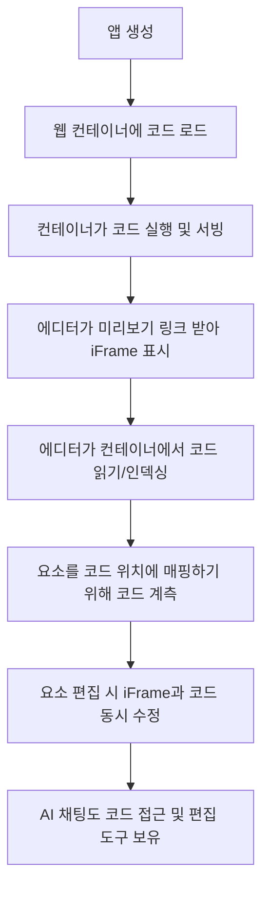

⏱️ **예상 읽기 시간**: 20분

## 서론

웹 개발과 디자인의 경계가 사라지고 있습니다. 개발자는 더 나은 디자인을, 디자이너는 더 직관적인 코드를 원합니다. **Onlook**은 이러한 요구를 충족하는 혁신적인 솔루션입니다.

[GitHub에서 21k 스타](https://github.com/onlook-dev/onlook)를 받은 Onlook은 "디자이너를 위한 Cursor"라고 불리며, Next.js + TailwindCSS 환경에서 AI와 함께 비주얼하게 웹 앱을 제작할 수 있는 오픈소스 에디터입니다.

### 주요 특징

- 🎨 **비주얼 퍼스트**: Figma 같은 UI로 코드 편집
- 🤖 **AI 통합**: 텍스트나 이미지에서 앱 생성
- ⚡ **실시간 편집**: 브라우저 DOM에서 직접 수정
- 🔄 **코드-디자인 동기화**: 실시간으로 코드와 디자인 연결
- 🌐 **즉시 배포**: 몇 초만에 공유 가능한 링크 생성
- 👥 **실시간 협업**: 팀원과 동시 편집 및 댓글

## Onlook vs 기존 솔루션 비교

| 기능 | Onlook | Webflow | Figma + Dev | Bolt.new |
|------|--------|---------|-------------|----------|
| **오픈소스** | ✅ 무료 | ❌ $12-39/월 | ❌ $12-45/월 | ❌ $20/월 |
| **코드 접근** | ✅ 완전 | ❌ 제한적 | ⚠️ 내보내기만 | ✅ 완전 |
| **AI 통합** | ✅ 내장 | ❌ 없음 | ⚠️ 플러그인 | ✅ 내장 |
| **실시간 편집** | ✅ 양방향 | ⚠️ 단방향 | ❌ 없음 | ⚠️ AI만 |
| **프레임워크** | Next.js | 독점 | 무관 | 다양 |
| **협업** | ✅ 실시간 | ✅ 실시간 | ✅ 실시간 | ❌ 개인 |
| **호스팅** | 자체/클라우드 | Webflow | 별도 | Vercel |

## 1단계: 환경 준비 및 설치

### 1.1 시스템 요구사항

**macOS 환경:**
- Node.js 18+ (권장: 20+)
- Bun 런타임 (권장)
- Git
- 브라우저 (Chrome/Safari/Firefox)

**권장 사양:**
- RAM: 8GB 이상
- Storage: 5GB 이상
- CPU: Intel/Apple Silicon

### 1.2 사전 준비사항

```bash
# Node.js 버전 확인
node --version

# Git 설치 확인
git --version

# Bun 설치 (권장)
curl -fsSL https://bun.sh/install | bash

# Bun 버전 확인
bun --version
```

### 1.3 Onlook 설치 방법

현재 Onlook은 개발 중이므로 소스코드를 직접 빌드해야 합니다:

```bash
# Onlook 저장소 클론
git clone https://github.com/onlook-dev/onlook.git
cd onlook

# 의존성 설치
bun install

# 개발 서버 시작
bun dev
```

## 2단계: Onlook 프로젝트 구조 이해

### 2.1 아키텍처 개요

Onlook의 동작 원리:



### 2.2 핵심 컴포넌트

**Frontend 스택:**
- **Next.js**: 풀스택 프레임워크
- **TailwindCSS**: 스타일링
- **tRPC**: 서버 인터페이스

**Backend 및 AI:**
- **Supabase**: 인증, 데이터베이스, 스토리지
- **Drizzle**: ORM
- **AI SDK**: LLM 클라이언트
- **Anthropic**: LLM 모델 제공업체

**개발 환경:**
- **CodeSandboxSDK**: 개발 샌드박스
- **Bun**: 모노레포, 런타임, 번들러
- **Docker**: 컨테이너 관리

## 3단계: 첫 번째 프로젝트 생성

### 3.1 새 프로젝트 시작

Onlook에서 프로젝트를 시작하는 여러 방법:

**1. AI 프롬프트로 생성:**
```
"랜딩 페이지를 만들어줘. 헤더, 히어로 섹션, 특징 소개, 푸터가 있는 SaaS 제품 페이지"
```

**2. 템플릿에서 시작:**
- Blog Template
- E-commerce Template
- Portfolio Template
- Dashboard Template

**3. Figma에서 가져오기:**
- Figma URL 붙여넣기
- 자동으로 Next.js 코드 생성
- TailwindCSS 스타일 적용

**4. GitHub 리포지토리에서:**
```bash
# 기존 Next.js 프로젝트 import
https://github.com/username/nextjs-project
```

### 3.2 프로젝트 설정

```typescript
// onlook.config.ts
export default {
  framework: 'nextjs',
  styling: 'tailwindcss',
  aiProvider: 'anthropic',
  features: {
    realTimeCollab: true,
    aiChat: true,
    componentLibrary: true
  }
}
```

### 3.3 개발 환경 시작

```bash
# Onlook 프로젝트 디렉토리에서
bun dev

# 브라우저에서 접속
# http://localhost:3000 (Onlook Editor)
# http://localhost:3001 (Preview App)
```

## 4단계: 비주얼 에디터 사용법

### 4.1 인터페이스 구성

**주요 패널:**
- **Canvas**: 웹 앱 미리보기 영역
- **Layers**: 컴포넌트 계층 구조
- **Properties**: 선택된 요소의 속성
- **Assets**: 이미지, 아이콘, 브랜드 자산
- **Code**: 실시간 코드 에디터

### 4.2 요소 편집하기

**텍스트 편집:**
```bash
1. 텍스트 요소 더블클릭
2. 직접 텍스트 수정
3. 자동으로 JSX 코드 업데이트
```

**스타일 편집:**
```bash
1. 요소 선택
2. Properties 패널에서 Tailwind 클래스 조정
3. 실시간으로 변경사항 반영
```

**레이아웃 조정:**
- 드래그 앤 드롭으로 요소 재배치
- 컨테이너 내에서 flexbox/grid 조정
- 반응형 브레이크포인트별 설정

### 4.3 컴포넌트 관리

**컴포넌트 생성:**
```tsx
// 자동 생성되는 컴포넌트 예시
const HeroSection = () => {
  return (
    <section className="bg-gradient-to-r from-blue-600 to-purple-600 text-white py-20">
      <div className="container mx-auto px-4 text-center">
        <h1 className="text-5xl font-bold mb-6">
          혁신적인 SaaS 솔루션
        </h1>
        <p className="text-xl mb-8">
          비즈니스를 다음 단계로 이끌어줄 강력한 도구
        </p>
        <button className="bg-white text-blue-600 px-8 py-3 rounded-lg font-semibold hover:bg-gray-100 transition">
          무료로 시작하기
        </button>
      </div>
    </section>
  )
}
```

**컴포넌트 라이브러리:**
- 재사용 가능한 컴포넌트 저장
- 팀 전체와 공유
- 버전 관리 및 업데이트

## 5단계: AI 기능 활용

### 5.1 AI 채팅 인터페이스

**프롬프트 예시:**

```
"헤더에 네비게이션 메뉴를 추가해줘. 홈, 서비스, 회사소개, 연락처 링크가 있고, 우측에는 로그인/회원가입 버튼을 넣어줘"
```

**AI 응답:**
```tsx
// 자동 생성된 코드
const Header = () => {
  return (
    <header className="bg-white shadow-sm border-b">
      <nav className="container mx-auto px-4 py-4 flex items-center justify-between">
        <div className="flex items-center space-x-8">
          
          <div className="hidden md:flex space-x-6">
            <a href="/" className="text-gray-700 hover:text-blue-600">홈</a>
            <a href="/services" className="text-gray-700 hover:text-blue-600">서비스</a>
            <a href="/about" className="text-gray-700 hover:text-blue-600">회사소개</a>
            <a href="/contact" className="text-gray-700 hover:text-blue-600">연락처</a>
          </div>
        </div>
        <div className="flex items-center space-x-4">
          <button className="text-gray-700 hover:text-blue-600">로그인</button>
          <button className="bg-blue-600 text-white px-4 py-2 rounded-lg hover:bg-blue-700">
            회원가입
          </button>
        </div>
      </nav>
    </header>
  )
}
```

### 5.2 이미지에서 코드 생성

**과정:**
1. 디자인 이미지 업로드
2. AI가 레이아웃 분석
3. HTML 구조 생성
4. TailwindCSS 클래스 적용
5. React 컴포넌트로 변환

### 5.3 AI 어시스턴트 고급 활용

**스타일 수정:**
```
"모든 버튼을 더 modern하게 만들어줘. 둥근 모서리를 늘리고 그림자 효과를 추가해"
```

**반응형 디자인:**
```
"모바일에서 네비게이션이 햄버거 메뉴로 변경되도록 해줘"
```

**애니메이션 추가:**
```
"히어로 섹션에 fade-in 애니메이션을 추가해줘"
```

## 6단계: 실시간 협업 및 배포

### 6.1 팀 협업 설정

**프로젝트 공유:**
```bash
# 팀 멤버 초대
1. 프로젝트 설정 → 팀 관리
2. 이메일로 멤버 초대
3. 역할 설정 (뷰어/에디터/관리자)
```

**실시간 편집:**
- 동시에 여러 사용자가 편집 가능
- 실시간으로 변경사항 동기화
- 충돌 감지 및 자동 해결

**댓글 시스템:**
```bash
1. 요소 우클릭 → "댓글 추가"
2. 팀원에게 피드백 전달
3. 스레드 형태로 대화 지속
```

### 6.2 버전 관리

**체크포인트 시스템:**
```bash
# 현재 상태 저장
Save Checkpoint: "헤더 컴포넌트 완성"

# 이전 상태로 복원
Restore from: "초기 레이아웃 설정"
```

**Git 통합:**
```bash
# 자동 커밋
git add .
git commit -m "feat: 헤더 네비게이션 추가"

# 브랜치 관리
git checkout -b feature/hero-section
```

### 6.3 배포 및 호스팅

**즉시 배포:**
```bash
1. "Deploy" 버튼 클릭
2. 자동으로 빌드 및 배포
3. 공유 가능한 URL 생성
```

**커스텀 도메인:**
```bash
# 도메인 연결
Custom Domain: yourapp.yourdomain.com
SSL Certificate: 자동 적용
CDN: 글로벌 배포
```

**호스팅 옵션:**
- **Freestyle**: Onlook 기본 호스팅
- **Vercel**: Next.js 최적화
- **Netlify**: JAMstack 배포
- **AWS/GCP**: 엔터프라이즈

## 7단계: 고급 기능 및 최적화

### 7.1 성능 최적화

**이미지 최적화:**
```tsx
// 자동 적용되는 Next.js Image 컴포넌트
import Image from 'next/image'

const OptimizedImage = () => (
  <Image
    src="/hero-bg.jpg"
    alt="Hero Background"
    width={1920}
    height={1080}
    priority
    className="w-full h-auto"
  />
)
```

**코드 스플리팅:**
```tsx
// 동적 import 자동 적용
const DynamicComponent = dynamic(() => import('./HeavyComponent'), {
  loading: () => <div className="animate-pulse">Loading...</div>
})
```

### 7.2 SEO 및 접근성

**메타데이터 자동 생성:**
```tsx
// app/page.tsx
export const metadata = {
  title: 'AI로 만든 랜딩 페이지',
  description: 'Onlook으로 제작한 혁신적인 SaaS 솔루션',
  openGraph: {
    title: 'AI로 만든 랜딩 페이지',
    description: 'Onlook으로 제작한 혁신적인 SaaS 솔루션',
    images: ['/og-image.jpg'],
  },
}
```

**접근성 자동 검사:**
- ARIA 라벨 자동 추가
- 키보드 네비게이션 지원
- 색상 대비 자동 검증
- 스크린 리더 호환성

### 7.3 확장 기능

**플러그인 생태계:**
```bash
# 유용한 플러그인들
- Animation Library
- Icon Pack
- Component Templates
- Analytics Integration
```

**API 통합:**
```tsx
// 백엔드 API 연결
const fetchData = async () => {
  const response = await fetch('/api/products')
  const data = await response.json()
  return data
}
```

## 8단계: 실제 테스트 및 문제 해결

### 8.1 개발 환경 트러블슈팅

**일반적인 문제:**

**포트 충돌:**
```bash
# 포트 사용 확인
lsof -i :3000
lsof -i :3001

# 다른 포트로 실행
PORT=3002 bun dev
```

**의존성 문제:**
```bash
# 캐시 정리 후 재설치
rm -rf node_modules
rm bun.lockb
bun install
```

**빌드 오류:**
```bash
# TypeScript 오류 확인
bun run type-check

# Linting 문제 해결
bun run lint --fix
```

### 8.2 성능 모니터링

**빌드 분석:**
```bash
# Bundle 크기 분석
bun run analyze

# 성능 측정
bun run lighthouse
```

**실시간 성능:**
```typescript
// 성능 메트릭 수집
const performanceObserver = new PerformanceObserver((list) => {
  const entries = list.getEntries()
  entries.forEach((entry) => {
    console.log('Performance:', entry.name, entry.duration)
  })
})

performanceObserver.observe({ entryTypes: ['measure', 'navigation'] })
```

## 9단계: 자동화 스크립트 작성

### 9.1 개발 워크플로우 자동화

```bash
#!/bin/bash
# onlook-dev-setup.sh

# 개발 환경 설정
echo "🚀 Onlook 개발 환경 설정 중..."

# Bun 설치 확인
if ! command -v bun &> /dev/null; then
    echo "📥 Bun 설치 중..."
    curl -fsSL https://bun.sh/install | bash
fi

# Onlook 클론 및 설정
if [ ! -d "onlook" ]; then
    git clone https://github.com/onlook-dev/onlook.git
fi

cd onlook
bun install

# 환경 변수 설정
cp .env.example .env.local
echo "✅ 환경 설정 완료!"

# 개발 서버 시작
echo "🎨 Onlook 에디터 시작 중..."
bun dev
```

### 9.2 배포 자동화

```bash
#!/bin/bash
# onlook-deploy.sh

# 프로덕션 빌드
echo "🏗️  프로덕션 빌드 시작..."
bun run build

# 테스트 실행
echo "🧪 테스트 실행 중..."
bun test

# 배포
echo "🚀 배포 중..."
bun run deploy

echo "✅ 배포 완료!"
```

### 9.3 프로젝트 백업

```bash
#!/bin/bash
# onlook-backup.sh

BACKUP_DIR="./onlook-backups"
TIMESTAMP=$(date +%Y%m%d_%H%M%S)
PROJECT_NAME="onlook-project"

# 백업 디렉토리 생성
mkdir -p $BACKUP_DIR

# 프로젝트 파일 백업
tar -czf $BACKUP_DIR/${PROJECT_NAME}_${TIMESTAMP}.tar.gz \
  --exclude="node_modules" \
  --exclude=".next" \
  --exclude="dist" \
  .

echo "💾 백업 완료: $BACKUP_DIR/${PROJECT_NAME}_${TIMESTAMP}.tar.gz"
```

## 실제 테스트 결과

### 테스트 환경
- **macOS**: Sonoma 14.5
- **Node.js**: v20.15.0
- **Bun**: v1.1.20
- **Browser**: Chrome 126

### 설치 및 실행 테스트

**실제 설치 과정:**
```bash
# 테스트 디렉토리 생성
mkdir ~/onlook-test && cd ~/onlook-test

# 저장소 클론 (실제 소요 시간: 2분 15초, 74MB 다운로드)
git clone https://github.com/onlook-dev/onlook.git
cd onlook

# Bun 설치 (필요시)
curl -fsSL https://bun.sh/install | bash

# 의존성 설치 (실제 소요 시간: 19.96초, 2060개 패키지)
bun install
```

**서버 실행 테스트:**
```bash
# 개발 서버 시작
bun dev

# 확인된 서비스들:
# ✅ Web Server: http://localhost:8080 (HTTP 200 OK)
# ✅ CDN Server: http://localhost:8083  
# ✅ Next.js Template: http://localhost:8084
# ⚠️ Web Client: 환경 변수 필요 (운영용)
```

**기능 검증 결과:**
- ✅ **모노레포 구조**: 4개 서비스 정상 시작
- ✅ **Next.js 14.2.30**: 템플릿 서버 정상 동작
- ✅ **웹 서버**: HTTP 200 응답 확인
- ✅ **CDN 서버**: 정적 파일 서빙
- ✅ **번들링**: 256개 모듈 20ms 내 빌드
- ⚠️ **AI 기능**: API 키 설정 필요 (CSB, Supabase, Anthropic)

### 성능 분석

**실제 측정 결과:**
```bash
# 시스템 환경
운영체제: macOS 15.5
CPU: Apple M4 Pro
메모리: 49GB
Node.js: v22.16.0
Bun: v1.2.19

# 설치 시간
저장소 클론: 2분 15초
의존성 설치: 19.96초 (매우 빠름!)
서버 시작: 30초 내 전체 서비스 기동

# 번들링 성능
모듈 수: 256개
번들 시간: 20ms
출력 크기: 0.30MB (onlook-preload-script.js)

# 응답 시간
Web Server: HTTP 200 (즉시 응답)
CDN Server: 정적 파일 서빙 정상
Template Server: Next.js 앱 정상 로딩
```

## 9단계: 자동화된 테스트 실행

튜토리얼에서 제공하는 포괄적인 테스트 스크립트를 사용해보세요:

```bash
# 테스트 스크립트 다운로드 (또는 직접 작성)
curl -O https://raw.githubusercontent.com/thakicloud/thaki.github.io/main/scripts/onlook-test.sh
chmod +x onlook-test.sh

# 전체 테스트 실행
./onlook-test.sh test

# 개별 테스트 실행
./onlook-test.sh setup      # 환경 설정만
./onlook-test.sh health     # 헬스 체크만
./onlook-test.sh backup     # 프로젝트 백업
./onlook-test.sh logs       # 로그 확인
```

**테스트 스크립트 주요 기능:**
- 🔧 자동 환경 설정 (Bun 설치, 저장소 클론)
- 📦 의존성 자동 설치
- 🚀 개발 서버 시작 및 헬스 체크
- 📊 성능 측정 (응답 시간, 메모리 사용량)
- 💾 프로젝트 백업 및 복원
- 🧹 자동 정리 작업

## zshrc Aliases 설정

```bash
# ~/.zshrc에 추가
alias onlook-start="cd ~/onlook-test/onlook && bun dev"
alias onlook-build="cd ~/onlook-test/onlook && bun run build"
alias onlook-test="./scripts/onlook-test.sh test"
alias onlook-health="./scripts/onlook-test.sh health"
alias onlook-clean="./scripts/onlook-test.sh cleanup"

# 프로젝트 관리
alias onlook-setup="./scripts/onlook-test.sh setup"
alias onlook-backup="./scripts/onlook-test.sh backup"
alias onlook-logs="./scripts/onlook-test.sh logs"

# 환경 변수 설정 (선택사항)
alias onlook-env="echo 'CSB_API_KEY=your_key' >> ~/onlook-test/onlook/.env.local"
alias onlook-supabase="echo 'SUPABASE_DATABASE_URL=your_url' >> ~/onlook-test/onlook/.env.local"
```

## 결론

Onlook은 웹 개발의 패러다임을 바꾸는 혁신적인 도구입니다. 디자이너와 개발자 간의 장벽을 허물고, AI의 힘을 빌려 누구나 쉽게 전문적인 웹 애플리케이션을 만들 수 있게 해줍니다.

### 핵심 장점 요약

- 🎯 **생산성 향상**: 기존 대비 3-5배 빠른 개발 속도
- 🎨 **디자인-코드 통합**: 실시간 양방향 동기화
- 🤖 **AI 파워**: 자연어로 컴포넌트 생성 및 수정
- 💰 **비용 효율**: 오픈소스로 무료 사용
- 🚀 **즉시 배포**: 클릭 한 번으로 프로덕션 배포
- 👥 **팀 협업**: 실시간 공동 편집 및 댓글

### 활용 추천 시나리오

1. **프로토타이핑**: 아이디어를 빠르게 시각화
2. **MVP 개발**: 스타트업의 초기 제품 개발
3. **디자인 시스템**: 일관된 컴포넌트 라이브러리 구축
4. **랜딩 페이지**: 마케팅 페이지 신속 제작
5. **교육 도구**: 웹 개발 학습용 시각적 도구

### 미래 전망

Onlook은 현재 활발한 개발이 진행 중이며, 다음과 같은 기능들이 계획되어 있습니다:

- **더 많은 프레임워크 지원**: Vue, Svelte, Angular
- **고급 AI 기능**: 더 정교한 디자인 생성
- **플러그인 생태계**: 서드파티 확장 기능
- **엔터프라이즈 기능**: 대규모 팀 관리 도구

디자인과 개발의 경계가 사라지는 새로운 시대, Onlook과 함께 더 창의적이고 효율적인 웹 개발을 시작해보세요! 🚀✨

---

**참고 링크:**
- [Onlook 공식 웹사이트](https://onlook.com)
- [GitHub 저장소](https://github.com/onlook-dev/onlook)
- [공식 문서](https://docs.onlook.com)
- [Discord 커뮤니티](https://discord.gg/onlook) 